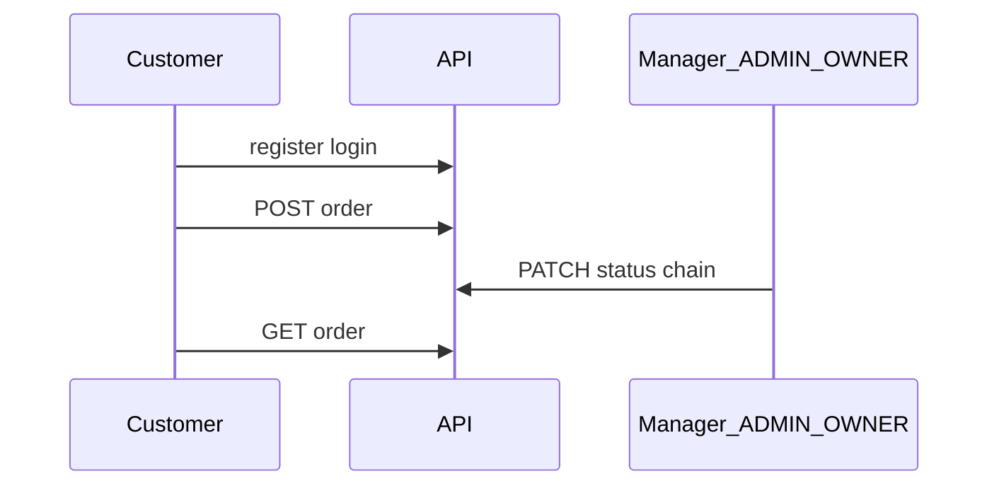

# Экспертный обзор GBCC Website Backend

Этот документ — **входная точка для разработчиков, архитекторов и сопровождения**: что делает сервис, как устроены роли, где границы доменов и куда смотреть за деталями. Формулировки упрощены; точные пути, параметры и схемы — в Swagger и в паспорте проекта.

---

## 1. Зачем этот сервис

Один Spring Boot backend закрывает **сайт витрины** (каталог, заказы покупателей, новости, акции, файлы, учётные записи, поддержка, заявки с форм) и **внутренний CRM-слой** под префиксом `/crm/**` (организации B2B, лиды, журнал звонков, задачи, поставки, контракты, карта, сводные метрики). Внешние системы (телефония, геокодеры, push) в продукте **не зашиты** — данные вводятся вручную, напоминания — через выборки API (например просроченные задачи).

---

## 2. Карта документации

| Документ | Для кого | Что внутри |
|----------|----------|------------|
| [README.md](../README.md) | Все | Запуск, Swagger, CORS, cookies, типичные сценарии для фронта, тесты |
| [PROJECT_PASSPORT.md](PROJECT_PASSPORT.md) | Архитектор, DevOps, онбординг | Стек с версиями, пакеты, полная карта REST-путей, роли, Flyway, логирование |
| [TZ_CRM_BACKEND_ALIGNMENT.md](TZ_CRM_BACKEND_ALIGNMENT.md) | Продукт + backend | Сверка пунктов ТЗ CRM с тем, что уже в коде и БД |
| [TEST_COVERAGE_GAPS.md](TEST_COVERAGE_GAPS.md) | Разработка | Приоритеты усиления тестов и как гонять интеграцию с Docker |
| **Swagger UI** (`/swagger-ui.html`) | Все | Живой контракт: тела запросов, коды ответов, схемы авторизации |

---

## 3. Стек и идея архитектуры

- **Java 21**, **Spring Boot 4**, классический **Spring Web MVC** + **Spring Security** + **Spring Data JPA**.
- **PostgreSQL**; схема версионируется **Flyway** (`src/main/resources/db/migration`).
- **JWT** лежит в **HttpOnly-cookie** (не в localStorage) — меньше риска XSS по отношению к токену.
- Код по доменам в `backend.website.gbcc.logic.<домен>`: рядом лежат контроллер, сервис, сущности, DTO, мапперы. Общие вещи — `config`, `filter`, `handler`, `model`.

**Простыми словами:** запрос приходит в контроллер, Security пропускает или нет по URL, JWT-фильтр при необходимости кладёт пользователя в контекст, сервис проверяет роль и владение данными, результат уходит в JSON; ошибки приводятся к одному виду (`ApiErrorResponse`) в `GlobalExceptionHandler`.

---

## 4. Две «витрины» данных: магазин и CRM

| Понятие | Путь API | Назначение простыми словами |
|---------|----------|------------------------------|
| **Заказ витрины (B2C)** | `/order` | Покупатель оформляет товар из каталога; статусы доставки ведут менеджеры. Это **не** оптовая поставка. |
| **Поставка CRM (B2B)** | `/crm/supplies` | Факт поставки контрагенту (организации); связь с карточкой организации. Отдельная модель от заказа сайта. |
| **Организация** | `/crm/organizations` | Карточка контрагента: адреса, контакты, статусы, ручные координаты для карты. |

Связь «заказ сайта ↔ организация CRM» в коде **не обязательна**; при появлении бизнес-требования её можно добавить отдельной миграцией (опциональный FK).

---

## 5. Роли (как в жизни)

| Роль в коде | Кто это | Что может (в общих чертах) |
|-------------|---------|----------------------------|
| **CUSTOMER** | Покупатель | Свой профиль, свои заказы, реферальная программа там, где предусмотрено, поддержка как клиент. |
| **ADMIN** | Менеджер / администратор сайта и CRM | Заявки, поддержка, акции, новости, смена статусов заказов, **CRM в рамках «своих» записей** (назначение, исполнитель задачи и т.д. — см. `CrmAccessPolicy`). |
| **OWNER** | Владелец данных / руководитель | Шире ADMIN: например переназначение заявок, полный обзор CRM, записи без назначенного менеджера в CRM. |

Первый **OWNER** может подниматься из конфигурации при старте приложения (`AccountOwnerInitializer` + `app.account.owner` в `application.yaml` / в тестах `application-test.yaml`).

---

## 6. Вход и сессия (cookies)

1. Клиент вызывает **POST `/auth/login`** с email и паролем.
2. Сервер ставит cookies **`GBCC_ACCESS_TOKEN`** (path `/`) и **`GBCC_REFRESH_TOKEN`** (path `/auth`).
3. Браузер с `credentials: 'include'` шлёт access-cookie на защищённые маршруты; бэкенд читает JWT в фильтре и подгружает аккаунт.

**Refresh:** POST `/auth/logout` и `/auth/refresh` — см. Swagger. Для ручных тестов (Postman) cookie можно скопировать из браузера или задать в Swagger «Authorize».

---

## 7. Безопасность по слоям (важно понимать)

В `SecurityConfig` часть путей явно `authenticated()`, часть `permitAll()`, а дальше стоит **`anyRequest().permitAll()`**. Это значит: **не всё** решается только списком URL — часть прав проверяется **внутри сервиса** (роль, «свой» заказ, гостевой токен поддержки и т.д.). При добавлении нового API нужно проверить **и** правило в Security, **и** проверки в `*ServiceImpl`.

---

## 8. CRM одной страницей

- **Организации** — центр B2B: реквизиты, контакты, история правок контактов.
- **Лиды** — «ещё не клиент»; конвертация в организацию — отдельный вызов API.
- **Взаимодействия** — журнал: кто, когда, с кем говорили, результат, следующий шаг; привязка к организации **или** лиду.
- **Задачи** — перезвоны и дела с дедлайном (`due_at`), исполнитель, статус; «напоминания» — фильтры и `overdue`.
- **Поставки и контракты** — ручные статусы и строки графика без интеграций.
- **Карта** — точки из сохранённых координат (не геокодер).
- **Метрики** — read-only сводка для дашборда в рамках скоупа роли.

Детальная сверка с ТЗ — [TZ_CRM_BACKEND_ALIGNMENT.md](TZ_CRM_BACKEND_ALIGNMENT.md).

---

## 9. Заказы витрины (коротко)

- Создаёт только **CUSTOMER** (**POST `/order`**).
- История и карточка — **GET /order**, **GET /order/{id}`**; клиент видит только свои заказы, менеджеры — любые (в рамках JWT).
- Смена статуса — **PATCH** у менеджера; переходы **жёстко валидируются** (нельзя «перепрыгнуть» вперёд и нельзя менять финальные статусы). Подробности статусов — enum и сервис `OrderServiceImpl`.

---

## 10. Остальные домены «в одну строку»

| Зона | Смысл |
|------|--------|
| **Product / Files** | Каталог и фото: публичные **GET**; **создание и изменение** товара и привязка фото — только **ADMIN/OWNER** (см. `SecurityConfig` и `ProductServiceImpl`). Загрузки файлов — по правилам `FileController` / Security. |
| **News / Promotion** | Контент и акции; правки обычно только менеджеры. |
| **Support** | Диалоги с клиентом; гость ходит по заголовку `X-Support-Token`. |
| **Contact / Cooperation requests** | Заявки с сайта; публичная отправка, разбор — ADMIN/OWNER с правилами «взять / отпустить» и конфликтами назначения. |
| **Referral** | Реферальная программа; отдельные админские отчёты. |
| **Account** | Регистрация клиента, поиск и блокировки, создание админов (см. ограничения в сервисе). |

Полная таблица путей — [PROJECT_PASSPORT.md раздел 5](PROJECT_PASSPORT.md).

---

## 11. Данные и миграции

- Все изменения схемы — только **новые файлы** `VNNN__...sql` по возрастанию номера.
- На проде важно не ломать порядок миграций и не включать случайно `out-of-order` без понимания последствий.

---

## 12. Ошибки и валидация

- Ошибки валидации полей — обычно **400** с массивом `fields` в `ApiErrorResponse`.
- Бизнес-запреты в сервисах — часто **400 / 403 / 404 / 409** через `ResponseStatusException`; формат тела тот же.

---

## 13. Тесты и качество

| Команда | Когда использовать |
|---------|-------------------|
| `mvn test` | Быстрая проверка: unit + WebMvc **без** Docker. |
| `mvn verify -Pintegration-tests` | Полный прогон с Testcontainers PostgreSQL; нужен **запущенный Docker**. |
| `mvn -DskipTests compile` | Только компиляция. |

После `verify` — отчёт JaCoCo: `target/site/jacoco/index.html`. Пробелы покрытия и приоритеты — [TEST_COVERAGE_GAPS.md](TEST_COVERAGE_GAPS.md).

---

## 14. Эксплуатация (минимальный чеклист)

- Задать ** datasource**, секрет **JWT**, при необходимости пути **файлового хранилища** (`application.yaml`).
- Убедиться, что для продакшена заданы осмысленные **секрет** и **пароль OWNER**, не значения из примера.
- Настроить **резервное копирование БД** и мониторинг приложения (логи, метрики, алерты) по стандартам организации.
- CORS глобально в проекте **не включён** — для отдельного фронтенд-origin нужен прокси или явная настройка (см. README).

---

## 15. Как не потеряться при изменениях

1. Контракт API — обновить **Swagger-аннотации** и при необходимости **версию** в `app.swagger.version`.
2. Схема БД — **Flyway** + сущности JPA + мапперы/DTO.
3. Права — **SecurityConfig** + проверки в **сервисе** + тест (WebMvc или unit).
4. CRM — держать в голове **CrmAccessPolicy** (OWNER vs скоуп ADMIN).
5. Документацию по CRM — обновлять **TZ alignment**, **паспорт** и при смысловых изменениях — этот гайд или README.

---

## 16. Визуально: поток «клиент и менеджер» вокруг заказа

Это упрощение витрины; CRM-жизнь идёт параллельно по `/crm/**` и не смешивается с путём `/order` без явного бизнес-решения.

---

*Версия обзора: 2026-05. При крупных изменениях продукта обновляйте этот файл вместе с README и PROJECT_PASSPORT.*
